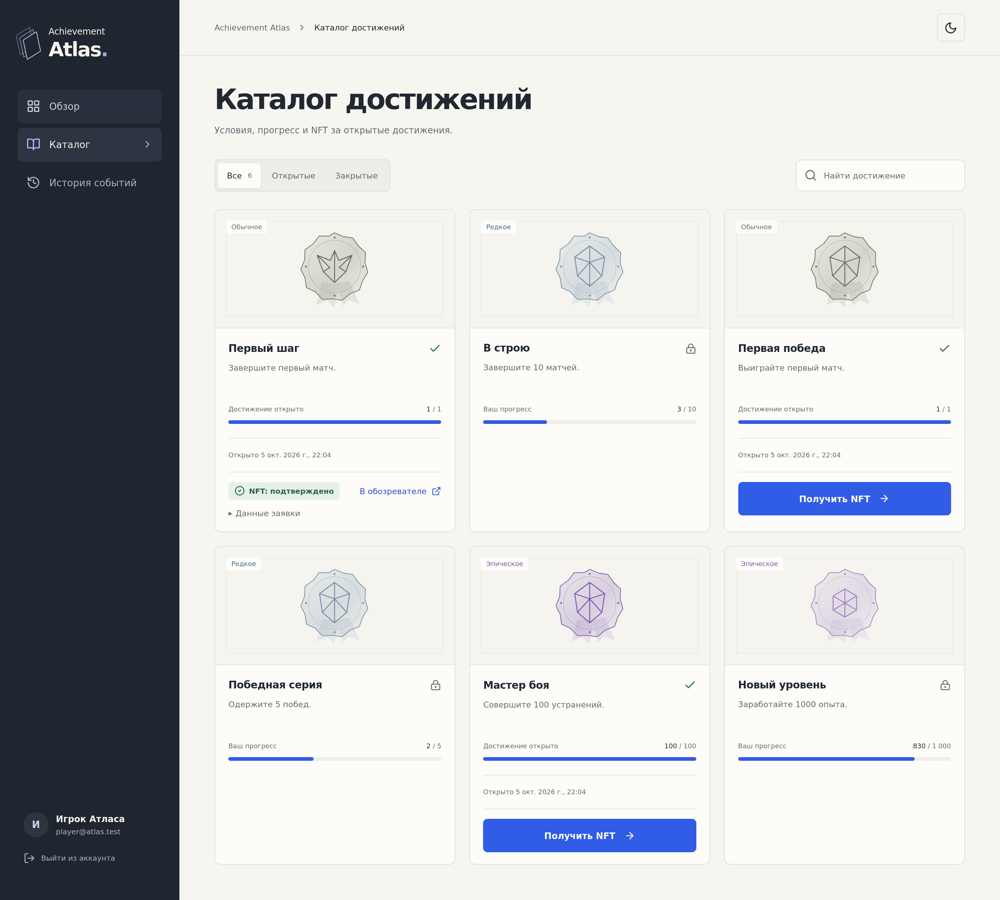
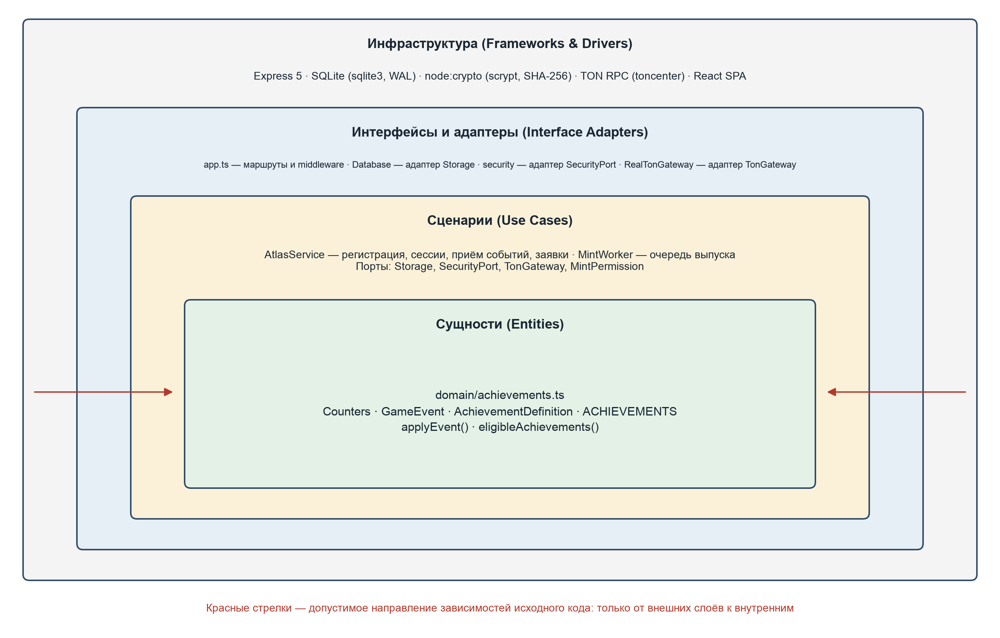

# Achievement Atlas

Серверная часть системы внутриигровых достижений с NFT. Курсовая работа по дисциплине «Проектирование и разработка серверных частей интернет-ресурсов» (РТУ МИРЭА, ИКБО-21-23).

Сервис принимает события от игрового сервера, ведёт статистику игрока, открывает достижения и выпускает за них NFT в блокчейне TON (тестовая сеть).



## Как это работает

1. Игровой сервер отправляет событие (`match.completed`, `combat.completed`, `xp.earned`) на `POST /api/events/ingest` с ключом `X-Game-Key`.
2. Сервис одной транзакцией сохраняет событие, обновляет счётчики игрока и открывает достижения, порог которых достигнут. Повтор того же события не начисляется дважды.
3. Игрок в личном кабинете запрашивает NFT за открытое достижение. Заявка попадает в очередь; обработчик выпускает токен и подтверждает его по данным блокчейна.

Игрок не может начислить себе прогресс: события принимаются только по ключу игрового сервера. Для демонстрации без игры есть «Симулятор игры», доступный оператору.

## Архитектура

Чистая архитектура, четыре слоя, зависимости направлены только внутрь.



| Слой | Где | Что |
|---|---|---|
| Сущности | `apps/server/src/domain` | каталог достижений, `applyEvent`, `eligibleAchievements` — чистые функции |
| Сценарии | `apps/server/src/application` | `AtlasService`, `MintWorker`, порты `Storage`, `SecurityPort`, `TonGateway` |
| Адаптеры | `apps/server/src/infrastructure`, `contracts/service`, `apps/server/src/app.ts` | SQLite, криптография, шлюз TON, HTTP-интерфейс Express |
| Клиент | `apps/web` | React-приложение: обзор, каталог, история событий, симулятор |

Правило зависимостей проверяется тестом `tests/server/architecture.test.ts`.

## Стек

TypeScript (strict), Node.js 20, Express 5, zod, SQLite (WAL), React 19, Vite 6, TON (`@ton/core`, `@ton/ton`), смарт-контракты FunC на основе референсной реализации NFT (TEP-62, метаданные TEP-64), Vitest, Supertest, TON Sandbox, Playwright.

## Запуск

Нужен Node.js 20.19+.

```sh
npm ci
npm run build
npm start          # http://127.0.0.1:3000
```

Настройки читаются из файла окружения; путь задаётся переменной `ATLAS_ENV_FILE` (по умолчанию `/etc/achievement-atlas/service.env`).

| Параметр | Назначение |
|---|---|
| `HOST`, `PORT` | адрес сервера, по умолчанию `127.0.0.1:3000` |
| `DB_PATH` | файл базы SQLite |
| `APP_ORIGIN` | разрешённые источники запросов через запятую |
| `GAME_API_KEY`, `GAME_SOURCE` | ключ и имя игрового сервера |
| `DEMO_MODE` | включает симулятор игры для оператора |
| `MINTING_ENABLED`, `TON_MINTING_ENABLED` | включают выпуск NFT (нужны оба) |
| `TON_COLLECTION_ADDRESS`, `TON_WALLET_ADDRESS` | адреса коллекции и кошелька сервиса |
| `TON_WALLET_SECRET_PATH` | файл с ключом кошелька (права 0600, вне репозитория) |
| `MINT_LIMIT` | предел числа заявок на выпуск |

По умолчанию симулятор и выпуск NFT выключены. Оператор создаётся командой:

```sh
OPERATOR_PASSWORD=... npm run operator:create -- operator@example.test 'Оператор'
```

## Тесты

```sh
npm test               # сервер: домен, архитектура, HTTP + БД, очередь выпуска
npm run test:sandbox   # смарт-контракты в TON Sandbox
npm run test:e2e       # сквозной сценарий в браузере
```

## Программный интерфейс

| Метод и путь | Доступ | Назначение |
|---|---|---|
| `GET /api/health` | все | состояние сервиса |
| `GET /api/auth/me` | все | текущий пользователь и CSRF-токен |
| `POST /api/auth/register`, `/login`, `/logout` | сессия | регистрация, вход, выход |
| `GET /api/achievements` | игрок | каталог, прогресс, сводка |
| `GET /api/events` | игрок | история событий |
| `GET /api/rewards` | игрок | открытые достижения и статусы NFT |
| `POST /api/rewards/:id/mint` | игрок | заявка на выпуск NFT |
| `GET /api/operator/users` | оператор | список игроков |
| `POST /api/operator/simulate` | оператор | демонстрационные события |
| `POST /api/events/ingest` | ключ игры | приём игрового события |

Подробности — в `docs/API-contract.md`.

## TON testnet

Контракты — в `contracts/`: `vendor/` содержит референсную реализацию (ревизия и контрольные суммы — в `provenance.json`), в `src/nft-collection.fc` изменён один get-метод. Работа ведётся только в тестовой сети.

```sh
npm run contracts:build
npm run wallet:prepare                 # создать кошелёк сервиса
npm run deploy:testnet -- --plan       # план развёртывания без отправки
npm run verify:testnet -- --item 0 --recipient <адрес>
```

Развёрнутые коллекции записаны в `contracts/deployments/`. Статус заявки «подтверждено» ставится только после проверки цепочки транзакций кошелёк → коллекция → элемент и данных токена.

## Структура

```
apps/server/src/   домен, сценарии, адаптеры, HTTP-интерфейс
apps/web/src/      клиентское приложение
contracts/         смарт-контракты, шлюз TON, тесты контрактов
tests/server/      тесты сервера
tools/             служебные сценарии: оператор, симулятор, развёртывание, E2E
docs/              описание API, диаграммы, экраны, журналы проверок
```
